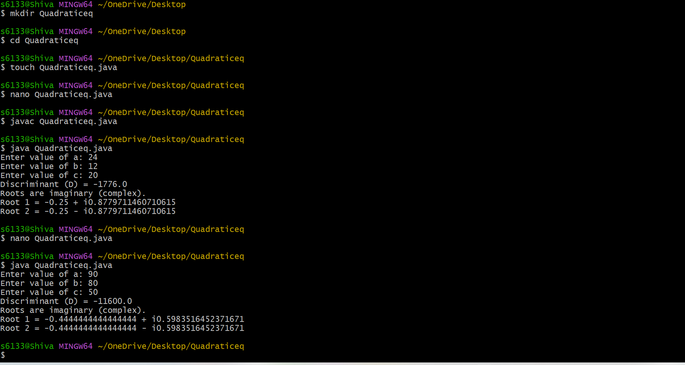

# EXPERIMENT.1
##TITLE-Defaultvalues
```java
class Defaultvalues{
byte b;
short s;
int i;
long l;
float f;
double d;
char c;
boolean bool;
public static void main(String[] args){
Defaultvalues obj=new
Defaultvalues();
System.out.println("Default byte value:"+obj.b);
System.out.println("Default short value:"+obj.s);
System.out.println("Default int value:"+obj.i);
System.out.println("Default long value:"+obj.l);
System.out.println("Default float value:"+obj.f);
System.out.println("Default double value:"+obj.d);
System.out.println("Default char value:"+obj.c);
System.out.println("Default boolean value:"+obj.bool);
}
}
```
#output

#EXP-1b
##TITLE-Quadratic
```java

import java.util.Scanner;

class QuadraticRoots {
    public static void main(String[] args) {

        double a, b, c, D;
        Scanner sc = new Scanner(System.in);

        System.out.print("Enter value of a: ");
        a = sc.nextDouble();

        System.out.print("Enter value of b: ");
        b = sc.nextDouble();

        System.out.print("Enter value of c: ");
        c = sc.nextDouble();

        D = b * b - 4 * a * c;
        System.out.println("Discriminant (D) = " + D);

        if (D > 0) {
            double root1 = (-b + Math.sqrt(D)) / (2 * a);
            double root2 = (-b - Math.sqrt(D)) / (2 * a);

            System.out.println("Roots are real and distinct.");
            System.out.println("Root 1 = " + root1);
            System.out.println("Root 2 = " + root2);

        } else if (D == 0) {
            double root = -b / (2 * a);
            System.out.println("Roots are real and equal.");
            System.out.println("Root = " + root);

        } else {
            double real = -b / (2 * a);
            double imaginary = Math.sqrt(-D) / (2 * a);

            System.out.println("Roots are imaginary (complex).");
            System.out.println("Root 1 = " + real + " + i" + imaginary);
            System.out.println("Root 2 = " + real + " - i" + imaginary);
        }

        sc.close();
    }
}
```
#output

